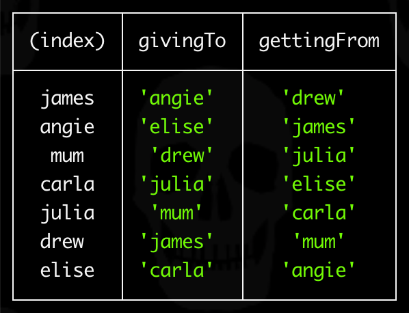

# secret-santa-recipient-generator

Secret Santa participant ↔︎ recipient generator.



## Contents

- [Quick Start](#quick-start)
- [Configuration](#configuration)
- [Node Scripts](#node-scripts)
- [License](#license)

## Quick Start

- [Configure](#environment-variables) `.env` file
- Ensure [Node](https://nodejs.org/en/download) running:<br>`$ node -v` >= `18.12.*`
- Ensure [NPM](https://docs.npmjs.com/downloading-and-installing-node-js-and-npm) running:<br>`$ npm -v` >= `9.1.*`
- Install dependencies:<br>
  `$ npm ci`
- Run generator:<br>
  `$ npm run generate`

## Configuration

- [Participants JSON](#participants-json)
- [Environment Variables](#environment-variables)

### Participants JSON

Create a `participants.json` file containing participant names:

```json
{
  "james": null,
  "angie": null,
  "mum": null,
  "carla": null,
  "julia": null,
  "drew": null,
  "elise": null
}
```

Optionally prefill recipient values where required:

```json
{
  "james": {
    "givingTo": "angie"
  },
  "angie": {
    "givingTo": "elise"
  },
  "mum": null,
  "carla": null,
  "julia": null,
  "drew": null,
  "elise": null
}
```

**Note:** The suggested `participants.json` file location is:

```text
./input/participants.json
```

### Environment Variables

Create a root `.env` file with appropriate values:

```ini
PARTICIPANTS_PATH=
LOG_LEVEL=
```

Example:

```ini
PARTICIPANTS_PATH=path/to/participants.json
LOG_LEVEL=debug
```

**Note:** Set `LOG_LEVEL=debug` for verbose console output.

## Node Scripts

- [Generate](#generate)

### Generate

To run the generator:

```console
$ npm run generate
```

Example output:

```text
┌─────────┬──────────┬─────────────┐
│ (index) │ givingTo │ gettingFrom │
├─────────┼──────────┼─────────────┤
│  james  │ 'angie'  │   'drew'    │
│  angie  │ 'elise'  │   'james'   │
│   mum   │  'drew'  │   'julia'   │
│  carla  │ 'julia'  │   'elise'   │
│  julia  │  'mum'   │   'carla'   │
│  drew   │ 'james'  │    'mum'    │
│  elise  │ 'carla'  │   'angie'   │
└─────────┴──────────┴─────────────┘
```

## License

ISC License

Copyright (c) 2022, James Furey

Permission to use, copy, modify, and/or distribute this software for any
purpose with or without fee is hereby granted, provided that the above
copyright notice and this permission notice appear in all copies.

THE SOFTWARE IS PROVIDED "AS IS" AND THE AUTHOR DISCLAIMS ALL WARRANTIES
WITH REGARD TO THIS SOFTWARE INCLUDING ALL IMPLIED WARRANTIES OF
MERCHANTABILITY AND FITNESS. IN NO EVENT SHALL THE AUTHOR BE LIABLE FOR
ANY SPECIAL, DIRECT, INDIRECT, OR CONSEQUENTIAL DAMAGES OR ANY DAMAGES
WHATSOEVER RESULTING FROM LOSS OF USE, DATA OR PROFITS, WHETHER IN AN
ACTION OF CONTRACT, NEGLIGENCE OR OTHER TORTIOUS ACTION, ARISING OUT OF
OR IN CONNECTION WITH THE USE OR PERFORMANCE OF THIS SOFTWARE.
